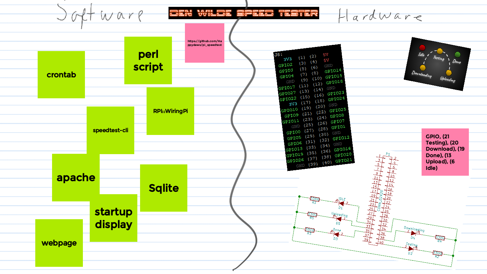
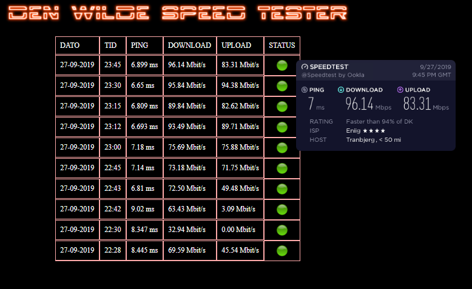
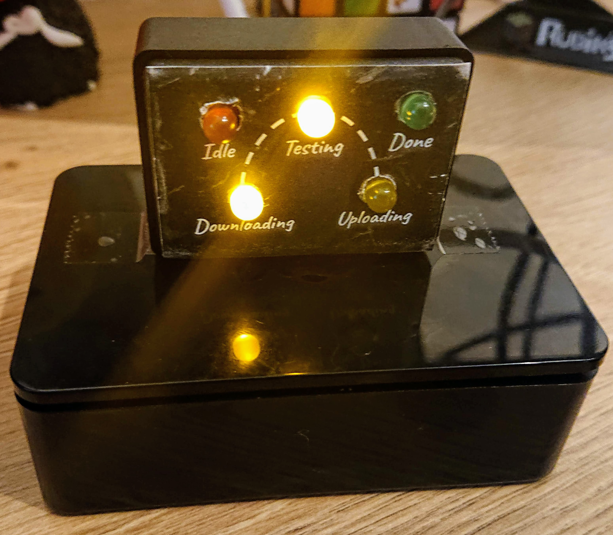

# pi_speedtest
### Project for an automatic speedtest on Raspberry Pi

#### Introduction
The project was started as i wanted to participate in solving a task given to our apprentice at the firm.
The task was as follows:
  * Everything should be up and running by just plugging in the power and ethernet cable to the PI
  * Run a SQL database
  * Start a webserver
  * Run a speedtest every 15 minutes
  * Save the result in the database
    * date, time, ping, (ms), download (Mbit/s), upload (Mbit/s), Status (ok)
  * The webserver should host a page neatly presenting the last 10 speedtests.

#### Initial approach
I wanted to use tools and solutions all freely available. (exept a few cheap and salvaged hardware pieces).

Firstly i created a [Google JamBoard](https://jamboard.google.com), which ended up as shown below. It went on evolving over the whole course of the project.

#### Software selection and approach
For solving the tasks i chose these solutions:
  * Startup scripts enters the desktop with a browser in kiosk mode showing the webpage, should you opt to connecting it to a display
  * For SQL i chose SQLite as it is lightweight and did the job fine
  * Webserver is a standard apache2 from the repo
  * Speedtest software is the [speedtest-cli](https://github.com/sivel/speedtest-cli) package
  * Script programming done in [PERL](https://www.perl.org/) using [perlbrew](https://perlbrew.pl/)
  * Controlling the GPIO is done using the [RPi::WiringPi](https://metacpan.org/pod/RPi::WiringPi) module
  * crontab used for scheduling the tests.
  
The webpage got the following design:

As an extra touch i saved the speedtest.net link in the database and show it when hovering the status icon.

#### Hardware
There were no hardware reqirements in the project, but as a former electrical engineer it's hard no to! 😄

The Pi is a 3b+ board given to us by the firm. I've wanted to try out making my own stuff for the GPIO for some time, and this was a neat little introduction.

I started by drawing a quick scetch of the wiring in [kicad](http://kicad-pcb.org/)

I found a tiny plastic casing, which i regretted over and over when putting it together with my fat fingers, and drilled holes for 5 Led's, soldered wires and resistors on and connected them to the GPIO.

I drew up a facing in [Google Drawings](https://docs.google.com/drawings/), still only using free tools. Printed the facing and glued it to the box.

The script powers on the "IDLE" LED when the tester is idle, turns on "Testing" when the speedtest starts, switches on "Download"/"Upload" LEDS when that part of the test is being done and finally lights up the "DONE" LED a few seconds before switching back to "IDLE"

The final physical project looks like this:

#### Final thoughts
All in all a fun little project. I learned a lot on how to communicate with the GPIO.

The complete project took about 15 hours.
